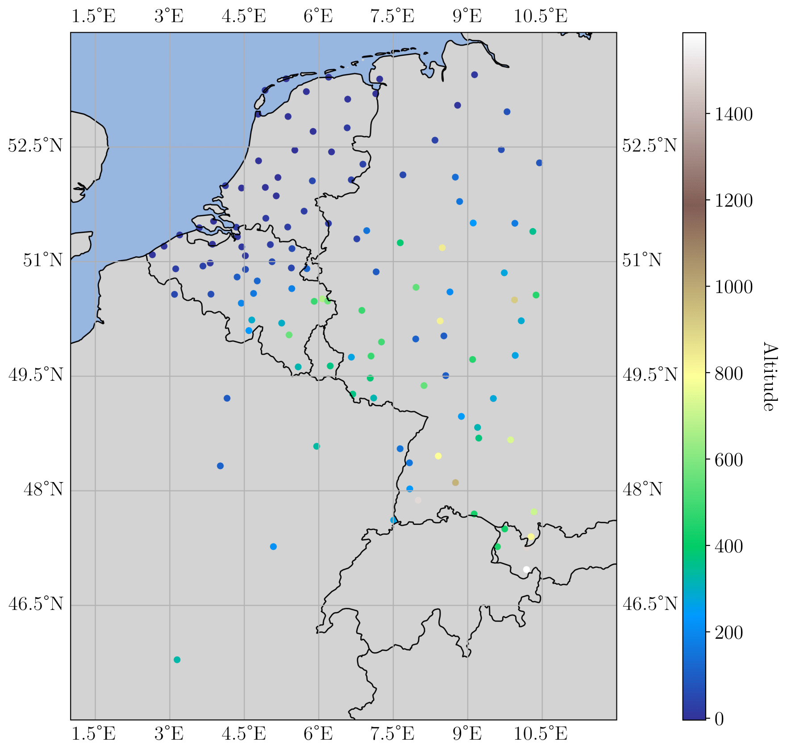

# Overview

In order to facilitate a fair and standardized comparison between post-processing methods, this dataset provides consistent input data and evaluation metrics.

This dataset is a modified version of [EUPPBench](https://essd.copernicus.org/articles/15/2635/2023/), a benchmark dataset for ensemble post-processing. The dataset includes medium-range ensemble forecasts from the European Centre for Medium-Range Weather Forecasts (ECMWF) along with corresponding station observations over an extended period for multiple lead times. In total, the data spans from 1997 to 2018 and includes 122 weather stations in Europe (see Figure 1 for details). Motivated by typical development practices for post-processing methods in operational weather prediction at meteorological services, the dataset contains both reforecasts and forecasts.



Reforecasts are NWP model runs for past dates, which are conducted to obtain a large archive of past forecasts for analyzing various properties of the NWP system. The EUPPBench dataset contains 4180 reforecasts with a reduced number of 11 ensemble members from 1997 to 2017. In addition, the EUPPBench dataset includes 730 daily operational forecasts from 2017–2018, which consist of 51 ensemble members. For both parts, a total of 31 predictor variables is available. We refer to [Demaeyer et al. (2023)](https://essd.copernicus.org/articles/15/2635/2023/) for details.

The *R2R* task consists of fitting a post-processing model to the reforecast data from 1997–2013 and testing this model on reforecasts from 2014–2017, whereas the *R2F* task aims to apply the fitted model to the forecast data from 2017–2018. The *R2F* task can be viewed as a typical pathway for developing a post-processing model in operational weather prediction and comes with additional technical challenges, e.g., the need to account for varying numbers of ensemble members in the training and test data.

## Sizes of the Training and testing Data

Sizes of the training, validation, and test datasets in terms of the number of days for which a forecast is available. There is a forecast for 122 stations for each day, generated by either 11 or 51 ensemble members for the reforecasts and forecasts, respectively. RF_Test and F_Test denote

| **Dataset** | **Ensemble Size** | **Years**   | **Reforecast?** |
|-------------|-------------------|-------------|-----------------|
| Train       | 11                | [1997-2013]   | ✔️               |
| RF_Test     | 11                | [2014-2017]   | ✔️               |
| F_Test      | 51                | [2017-2018]   | ❌              |

## Evaluation

The main evaluation metric in the post-processing literature is the continuous ranked probability score (CRPS) given by

$$
\text{CRPS}(F,y) = \int_{-\infty}^{\infty} \left( F(z) - \mathbf{1}(y \leq z)\right)^2 \, \text{d}z,
$$

where $F$ is the cumulative distribution function of the forecast distribution, $y$ is the realizing observation, and $\mathbf{1}$ denotes the indicator function. [Gneiting et al. (2014)](https://www.annualreviews.org/content/journals/10.1146/annurev-statistics-062713-085831).

The CRPS simultaneously evaluates calibration and sharpness of the forecast distribution and can be computed in analytical form for ensembles and many parametric families [Jordan et al. (2019)](https://www.jstatsoft.org/article/view/v090i12).

## How to contribute

Just create a pull request the scores of you model to the tables in ```docs/scoreboard.md```
